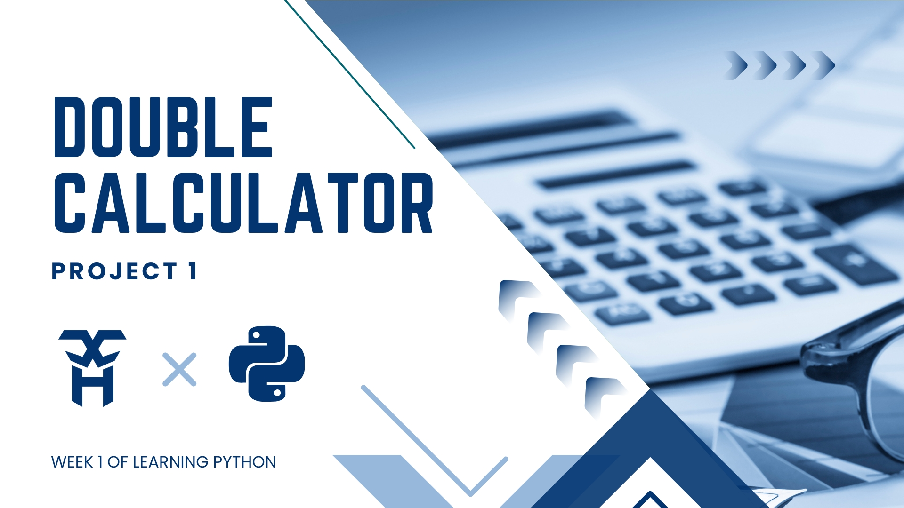

# Calculator
<h1 align="center">Double Calculator in Python</h1>

# Calculator Project

## Table of Contents

- Overview
- Features
- Calculator Modes
- How It Works
- Program Flow
- Variables
- Input Validation
- Operations Logic
- Data Structures
- Example Run
- Test Cases
- Limitations
- Future Improvements
