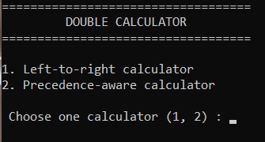

<h1 align="center">Double Calculator in Python</h1>
<p align="center">

</p>

## Table of content

- [How it works](#how-it-works)
  - [Left-to-right calculator](#left-to-right-calculator)
  - [Precedence-aware calculator](#precedence-aware-calculator)
- [Built With](#built-with)
- [Installation](#installation)
- [AI Usage](#ai-usage)
- [Author](#author)

## How it works
Creates variables to use later and asks the user to choose the calculator type.
```python
Numbers = []
Operators = []
solution = 0
type = int(input("=================================== \n         DOUBLE CALCULATOR          \n=================================== \n\n1. Left-to-right calculator \n2. Precedence-aware calculator \n \n Choose one calculator (1, 2) : "))
start = 0
```
`while start < 1:` this loop keeps the program running.

### Left-to-right calculator
Gets the first number.
```python
    if type == 1:

        try:
            Numbers.append(float(input('Enter a number : ')))
        except ValueError:
            print('Invalid Number, Try again')
            Numbers.append(float(input('Enter a number : ')))

        i=0
```
Gets the operators and numbers.
```python
        while i < 6:

            Operators.append(input('Enter an operator (+, -, *, /) : '))
            if Operators[i] == "*" or Operators[i] == "/" or Operators[i] == "+" or Operators[i] == "-":
                pass
            else:
                print("Invalid Operator, Try again")
                Operators.remove(Operators[i])
                Operators.append(input('Enter an operator (+, -, *, /) : '))

            try:
                Numbers.append(float(input('Enter a number : ')))
            except ValueError:
                print('Invalid Number, Try again')
                Numbers.append(float(input('Enter a number : ')))
```
Performs simple math immediately.
```python
            if i == 0:
                if Operators[0] == "*" or Operators[0] == "/":
                    if Operators[0] == "*":
                        solution = Numbers[0] * Numbers[1]
                    else:
                        solution = Numbers[0] / Numbers [1]
                if Operators[0] == "+" or Operators[0] == "-":
                    if Operators[0] == "+":
                        solution = Numbers[0] + Numbers[1]
                    else:
                        solution = Numbers[0] - Numbers[1]
            else:
                if Operators[i] == "*" or Operators[i] == "/":
                    if Operators[i] == "*":
                        solution = solution * Numbers[i+1]
                    else:
                        solution = solution / Numbers [i+1]
                if Operators[i] == "+" or Operators[i] == "-":
                    if Operators[i] == "+":
                        solution = solution + Numbers[i+1]
                    else:
                        solution = solution - Numbers[i+1]
            print (solution)
```
Asks the user whether to restart or not.
```python
            if i == 5:
                choice = input('Restart (Y/N) : ')
                if choice == "Y" or choice == "y":
                    start = 0
                    break
                elif choice == "N" or choice == "n":
                    start = 1
                    break
                else:
                    print("Invalid Answer, Try again")
                    choice = input('Continue (Y/N)')
            else:
                choice = input('Continue (Y/N) : ')
                if choice == "Y" or choice == "y":
                    i += 1
                    continue
                elif choice == "N" or choice == "n":
                    choice = input('Restart (Y/N) : ')
                    if choice == "Y" or choice == "y":
                        start = 0
                        Numbers.clear()
                        Operators.clear()
                        solution = 0
                        break
                    elif choice == "N" or choice == "n":
                        start = 1
                        break
                    else:
                        print("Invalid Answer, Try again")
                        choice = input('Continue (Y/N)')
                else:
                    print("Invalid Answer, Try again")
                    choice = input('Continue (Y/N)')
```
### Precedence-aware calculator
Gets numbers and operators.
```python
    elif type == 2:
        
        try:
            Numbers.append(float(input('Enter a number : ')))
        except ValueError:
            print('Invalid Number, Try again')
            Numbers.append(float(input('Enter a number : ')))

        i=0

        while i < 6:
            Operators.append(input('Enter an operator (+, -, *, /) : '))
            if Operators[i] == "*" or Operators[i] == "/" or Operators[i] == "+" or Operators[i] == "-":
                pass
            else:
                print("Invalid Operator, Try again")
                Operators.remove(Operators[i])
                Operators.append(input('Enter an operator (+, -, *, /) : '))

            try:
                Numbers.append(float(input('Enter a number : ')))
            except ValueError:
                print("Invalid Number, Try again")
                Numbers.append(float(input('Enter a number : ')))
            
            answer = input('Continue (Y/N) : ')
            if answer == "Y" or answer == "y":
                i += 1
            elif answer == "N" or answer == "n":
                i = 6
                a = 0
```
Simplifies operations so we only need to work with "+" and "*".
```python
                while a < len(Operators):
                    if Operators[a] == "-":
                        Numbers[a+1] =  -Numbers[a+1]
                        Operators[a] = "+"
                    elif Operators[a] == "/":
                        Numbers[a+1] = 1 / Numbers[a+1]
                        Operators[a] = "*"
                    else:
                        pass
                    a += 1
```
Multiplies chained numbers connected by "*" and stores them in temp, while numbers connected by "+" without a "*" before or after are added directly to solution.
```python             
                temp = []
                a=0
                while a < len(Operators):
                    if Operators[a] == "*":
                        if a == 0:
                            temp = [Numbers[0]]
                        else:
                            pass    
                        temp[-1] = temp[-1] * Numbers[a+1]
                    else:
                        if (
                            (a > 0 and Operators[a-1] == "*")
                            or
                            (a < len(Operators)-1 and Operators[a+1] == "*")
                        ):
                            temp.append(Numbers[a+1])
                            if a == 0:
                                solution = Numbers[a] 
                            else:
                                pass
                        else:
                            if a == 0:
                                solution = Numbers[a] + Numbers[a+1]
                            else:
                                solution = solution + Numbers[a+1]
                    a += 1
```
Adds what was stored in solution and temp.
```python
                a=0
                while a < len(temp):
                    solution = solution + temp[a]
                    a += 1

                print(solution)
```
Asks the user whether to restart or not.
```python
                choice = input('Restart (Y/N) : ')
                if choice == "Y" or choice == "y":
                    start = 0
                    Numbers.clear()
                    Operators.clear()
                    solution = 0
                    break
                elif choice == "N" or choice == "n":
                    start = 1
                    break
                else:
                    print("Invalid Answer, Try again")
                    choice = input('Continue (Y/N)')
        
            else:
                print("Invalid Answer, Try again")
                answer = input('Continue (Y/N)')

    else:
        print("Invalid Number")
        answer = int(input('Choose one calculator (1, 2) : '))
```
## Built With

- Python

## Installation
To Download it, check the latest Windows version from the **Releases** page.

Here → https://github.com/xtrawalo/Calculator/releases/latest

View the project on **Horizons** : https://horizons.hackclub.com/app/projects/5501

## AI USAGE

This project is my own work. I used Claude only for debugging.

## Author

Me : [xtrawalo](https://github.com/xtrawalo)
